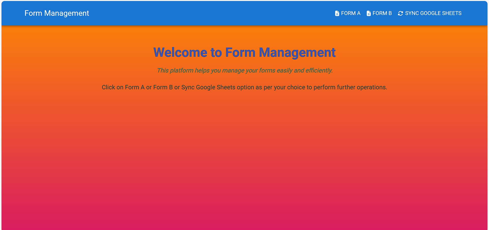
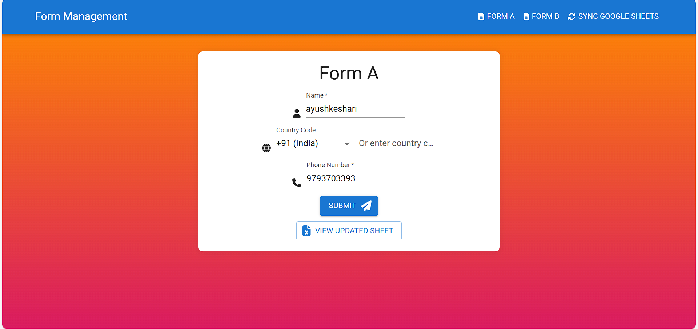
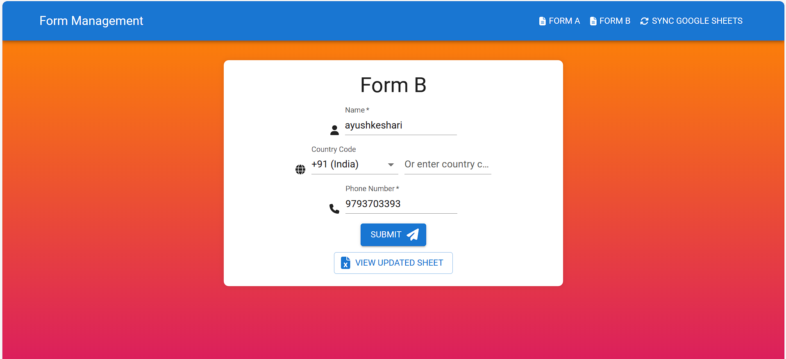
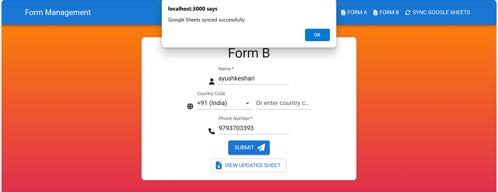
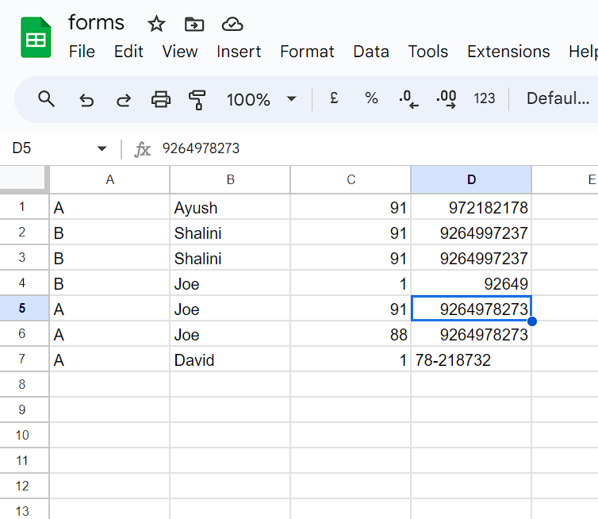

# 📋 Form Management System

Welcome to the Form Management System! This project provides a seamless solution for managing forms efficiently, comprising both backend and frontend components.

## 🌟 Overview

The project is structured into two main directories: `backend` and `frontend`. The backend directory contains the server-side logic, including database configuration and form models. The frontend directory encompasses the user interface components, allowing users to interact with forms easily.


## 🔧 Installation and Setup

1. Clone the repository:

    ```bash
    git clone <repository-url>
    ```

2. Install backend dependencies:

    ```bash
    cd backend
    npm install
    ```

3. Install frontend dependencies:

    ```bash
    cd frontend
    npm install
    ```

4. Start the backend server:

    ```bash
    cd backend
    npm start
    ```

5. Start the frontend development server:

    ```bash
    cd frontend
    npm start
    ```

## 🖼️ Image







## 💻 Technologies Used

- **Backend**:
  - Node.js
  - Express.js
  - MySql

- **Frontend**:
  - React.js
  - HTML
  - CSS

## 🔄 Google Sheets Integration

To synchronize data with Google Sheets, we utilized the Google Sheets API. This allows us to read from and write to Google Sheets directly from our application. By integrating Google Sheets, we ensure real-time data updates and easy collaboration among users.

## 🌐 Connecting to Online Excel Sheet

To implement functionality to connect to an online Excel sheet, follow these steps:

1. **Identify the online Excel sheet's URL or API endpoint.** Obtain the URL or API endpoint of the online Excel sheet you want to connect to.

2. **Install `xlsx`.** Install the `xlsx` library in your Node.js project. You can do this using npm:

    ```bash
    npm install xlsx
    ```

3. **Use `xlsx` to read the online Excel sheet.** Utilize `xlsx` in your backend code to read the online Excel sheet. For example:

    ```javascript
    const xlsx = require('xlsx');
    const workbook = xlsx.readFile('https://example.com/path/to/your/excel/file.xlsx');

    const worksheetName = workbook.SheetNames[0];
    const worksheet = workbook.Sheets[worksheetName];

    const jsonData = xlsx.utils.sheet_to_json(worksheet);
    console.log(jsonData);
    ```

    Replace `'https://example.com/path/to/your/excel/file.xlsx'` with the URL of your online Excel sheet.

4. **Process the data as needed.** Once you've read the data from the online Excel sheet into JSON format, you can process it as needed in your application.

    For example, you can iterate over the JSON data and perform operations or store it in your database:

    ```javascript
    jsonData.forEach(row => {
      // Process each row of data
      console.log(row);
    });
    ```

    You can also modify the data and write it back to the Excel sheet using the `xlsx` library if necessary.

5. **Handle errors appropriately.** Ensure that you handle errors gracefully, especially when dealing with network requests or file I/O operations.

That's it! By following these steps, you'll be able to connect to and read data from an online Excel sheet in your Node.js application using the `xlsx` library.


## ✨ Contributors

- [Ayush Keshari](https://github.com/ayush2-wd)

## 📜 License

This project is licensed under the MIT License. See the [LICENSE](LICENSE) file for details.

